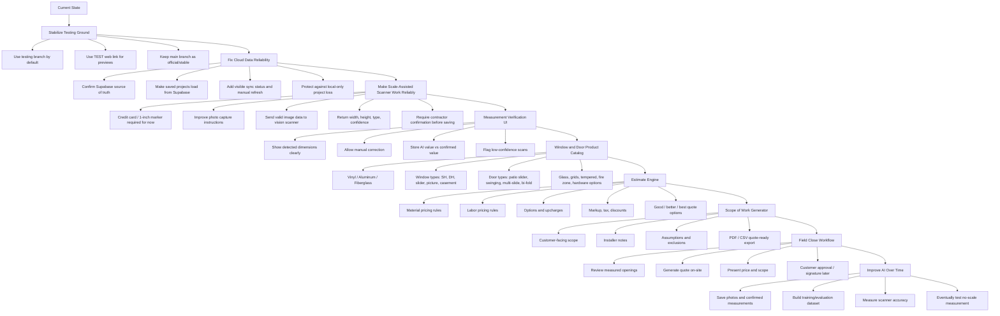

# DimensionsPro Project Roadmap

## Goal

Build a web/phone-based contractor tool that measures windows and doors from photos, creates verified measurements, generates estimates, produces a scope of work, and helps close the job during the first customer meeting.

## Flow Chart

## Recommended Order

1. Cloud reliability first
   Make sure projects save/load correctly from Supabase on the TEST web app. If saved jobs disappear or only live in browser storage, everything else becomes shaky.

2. Scanner reliability second
   Keep the credit card or 1-inch marker requirement. The goal is not no-scale yet. The goal is: photo in, measurement suggestion out, contractor confirms.

3. Verification screen third
   Never let AI measurements silently become final. Show the result, confidence, and allow correction.

4. Pricing/catalog fourth
   Once measurements are dependable, add the dealer product rules: material, type, glass, grids, install type, labor.

5. Estimate and scope fifth
   Turn confirmed openings into a customer-ready quote and scope of work.

6. Close-on-site workflow last
   Make the app feel like a sales tool: measure, review, estimate, present, close.

## Next Milestone

Projects reliably save/load in Supabase, then DimensionSnap produces verified scale-assisted measurements on the TEST web app.
